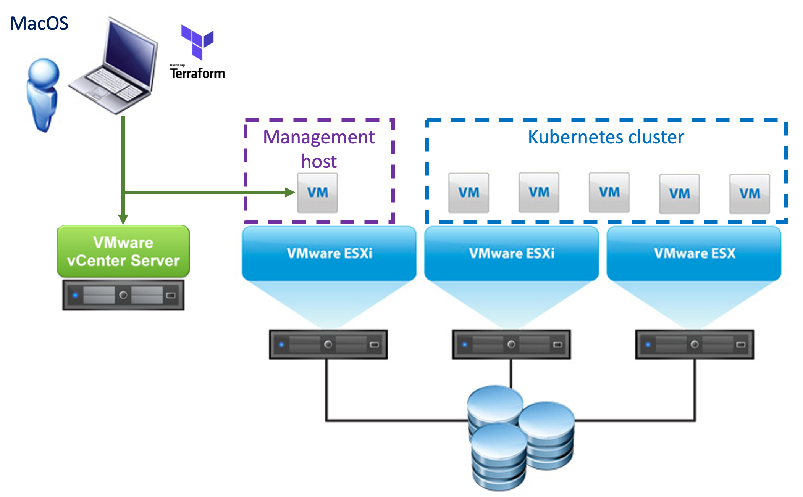

# Deploy Kubernetes on VMware vSphere using Terraform and Kubespray
This Terraform project allows you to deploy Kubernetes on vSphere. It uses Kubespray for the deployment and allows you to tweak (some, more are coming is time permits) of the deployment options.

## What does this project do?
This Terraform project will automatically create VM's on VMware vSphere required to deploy Kubernetes using Kubespray. Then it will download Kubespray and prepare the nodes. Finally it can automatically run Kubespray to deploy Kubernetes, but you can also choose to hold-of with the Kubespray deployment (see the `run_kubespray` parameter in `variables.tf`), so that you can twaek the Kubespray parameters. Once have the correct settings in place for Kubespray you can run Kubespray with a single command (`~/run_kubespray.sh`) to deploy Kubernetes.

Once the deployment is done you get an Administrative Linux VM, which contains the Kubespray software in it's home directory, so that you can maintain the cluster afterwards. It can also be used to run `kubectl` and access your Kubernetes environment.
Besides the Administrative Linux VM, it will create the number of Kubernetes nodes you have specified (see `number_of_nodes` parameter in `variables.tf`) and deploy Kubernetes on those nodes.

## System requirements

To be able to apply this Terraform configuration to your vSphere environment, make sure you have to following requirements in place. Basically all you need are git, for cloning the github repo and the Terraform binary to run the playbook.

### MacOS:
- Install xcode, since xcode contains tools like `git` that we use to download this repo.
  ```
  xcode-select --install
  ```

- Install Terraform, see https://learn.hashicorp.com/terraform/getting-started/install.html for instructions.

  Example steps for installing Terraform 0.12.23 (latest version at the time of writing):
  ```
  curl -O https://releases.hashicorp.com/terraform/0.12.23/terraform_0.12.23_darwin_amd64.zip
  unzip terraform_0.12.23_darwin_amd64.zip
  sudo mkdir -p /usr/local/bin
  sudo mv terraform /usr/local/bin/
  ```

  Test the Terraform installation (this command should return the Terraform version installed):
  
  `terraform -v`
  
## Deployment procedure
The following steps need to be executed in order ot deploy Kubernetes using this Terraform configuration to your VMware vSphere environment.

1. Download an Ubuntu Cloud image OVA (http://cloud-images.ubuntu.com/bionic/current/bionic-server-cloudimg-amd64.ova) and add that to your vSphere environment as template virtual machine.
2. The first step is to download this repo to you workstation.

   ```
   git clone https://github.com/dnix101/k8s-on-vsphere.git
   ```

3. Change the `variables.tf` file to match your environment.
   - Specify your vCenter server details, cluster, datastore and networking details in the `vsphere_config` section;
   - If you which make changes to the `k8s-global` settings or the `k8s-adminhost` settings if you want;
   - Make sure you set the correct iscsi_subnet (if you require it) in the `k8snodes` section.
4. Deploy Kubernetes using Terraform by executing the following commands:

   - First we need to initialize terraform (downloading the required Terraform providers for this project)
   
     `terraform init`
   
   - econdly we need to plan the terraform project, to make sure we are ready to deploy. You might get some errors on your vSphere environment details if you made a mistake in the variables.tf file.
   
     `terraform plan`
   
   - Finally apply the project, at which point the VM's and Kubespray are being deployed.
   
     `terraform apply`
   
## Working with the deployment
Once the deployment is complete you can start using it. 

**Get the IP addresses**
The previous `terraform apply` command will return the IP addresses of the Administrative host and the Kubernetes nodes, however if you missed that message, use the following command to get the IP addresses for the deployment.

`terraform output`

**Logon to the administrative host**
To logon to the administrative host you can use the user created (see `username` option in `variables.tf` file) and the private key that was created by the deployment.

`ssh -i keys/id_rsa-k8s-on-vmware k8sadmin@[use IP address from output above]`

The command above will automatically connect and log you in on the Administrative host.

**Optional: Tweak Kubespray parameters**
If you have chosen to not run Kubespray automatically during the deployment, you can now tweak the Kubespray sessions. The parameters are located in the following directory:

`~/kubespray/inventory/k8s-on-vmware/`

Once you're done with the settings, kick-off the Kubespray with the following command to deploy Kubernetes:

`~/run-kubespray.sh`

This will install Kubernetes and should complete automatically. It might show some errors (especially when configuring etcd), but normally these can be ignored, as Kubespray retries until all services come online.

**Start using Kubernetes**
Once Kubespray has finished, you can start using the Kubernetes cluster from the Administrative host. The Kubernetes config file is saved by the `run-kubespray.sh` script on the Administrative host, which means that you can start managing the Kubernetes cluster directly using `kubectl`.

Show nodes:

`kubectl get nodes -o wide`

Show all Kubernetes resouces on the cluster:

`kubectl get all -A`

**Anything else?**
Well you're on your own from here, however checkout the `add-ons` folder to deploy some regular components like creating a Dashboard user (for some GUI management), Metal Load Balancer (metallb) for a load balancera and the NGINX Ingress service.
